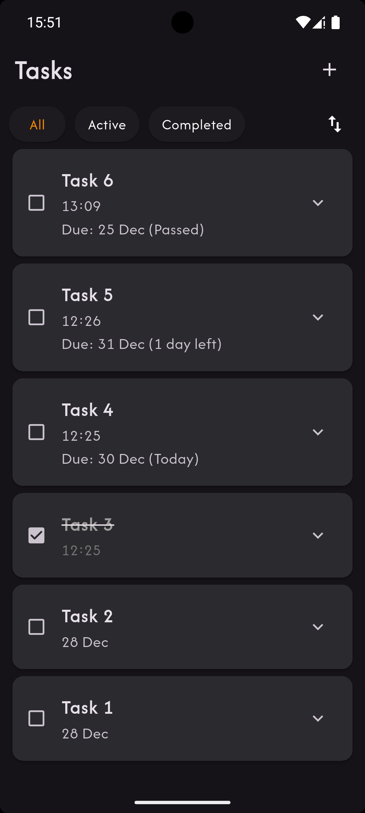
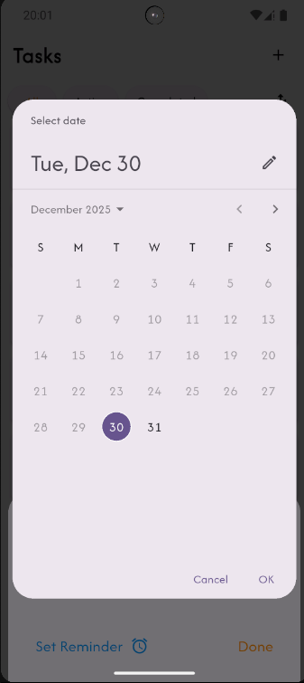
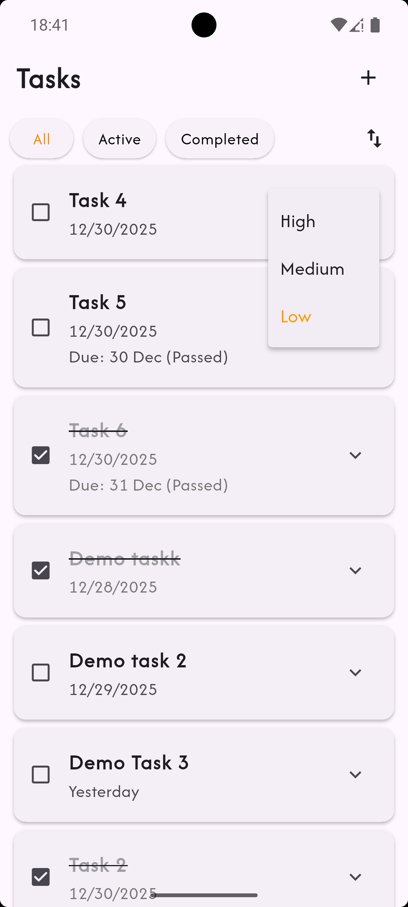
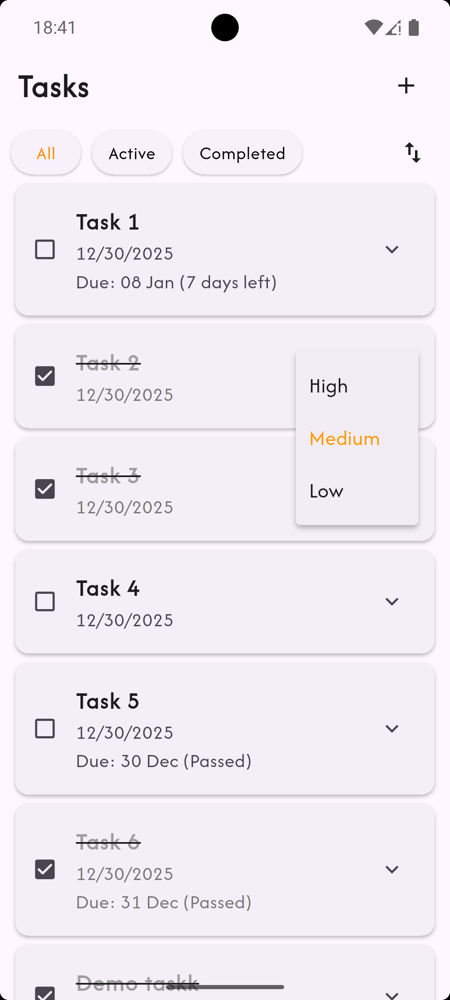
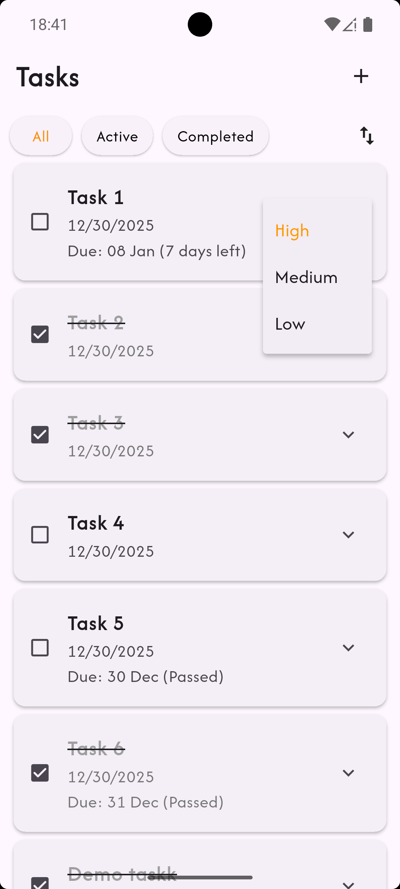
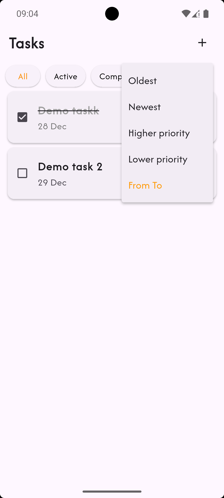
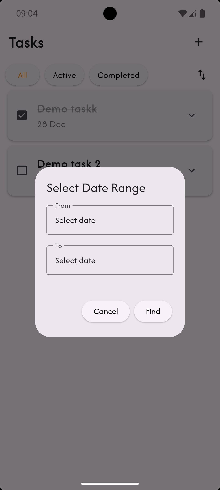

# to_do_app

A simple yet strucutred to-do application.

Features:
- Add, edit and remove tasks
- Mark the tasks as complete or incomplete
- Sort the tasks by date and priority
- Filter tasks by their state of completion (All/Active/Completion)
- Set due dates for tasks

This project uses BLoC for state management.
The app follows a clear separation of concerns:
- UI reacts to state changes
- Business logic is handled inside BLoCs
- Events drive all state transitions

All user actions (add, update, delete, select, complete) are dispatched as events and processed by the relevant BLoC.

Screenshots:

Home Screen UI:

  
  

Task editing:

  
  

Setting priority:

  
  
  

Sort Highlighting and FromTo sort:

  
  

